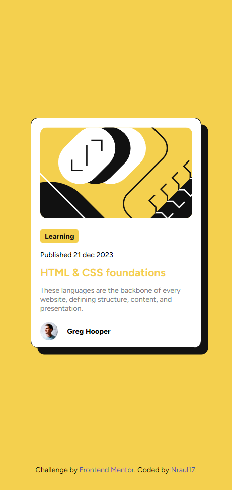
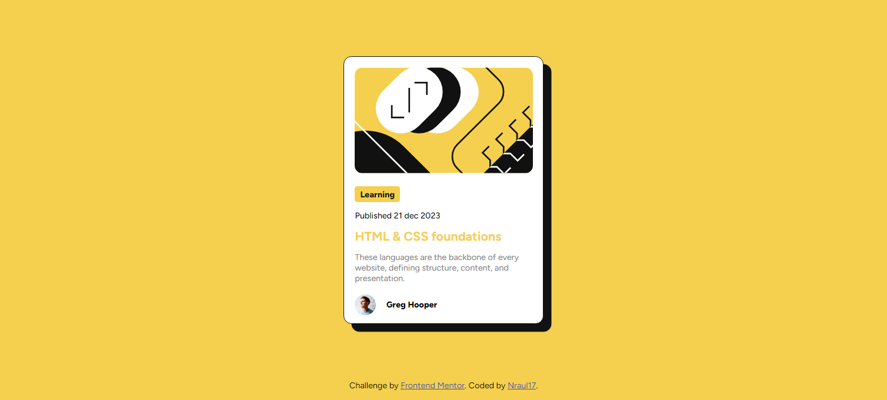

# Frontend Mentor - QR code component solution

This is a solution to the [QR code component challenge on Frontend Mentor](https://www.frontendmentor.io/challenges/qr-code-component-iux_sIO_H). Frontend Mentor challenges help you improve your coding skills by building realistic projects.

## Table of contents

- [Overview](#overview)
  - [Screenshot](#screenshot)
  - [Links](#links)
- [My process](#my-process)
  - [Built with](#built-with)
  - [What I learned](#what-i-learned)
  - [Continued development](#continued-development)
- [Author](#author)

**Note: Delete this note and update the table of contents based on what sections you keep.**

## Overview

### Screenshot

 

As you can see, the card works on both desktop and mobile devices. This is very important, since currently most visits to websites are made from a smartphone.

### Links

- Solution URL: [Find the solution here--->](https://github.com/nraul17/Frontend-Mentor-QR-Code.git)

## My process

### Built with

- Semantic HTML5 markup
- CSS custom properties
- Flexbox
- CSS Grid
- Mobile-first workflow
- VS Code

### What I learned

With this exercise I put into practice my knowledge about flexbox and its properties. Being a newbie to this interesting world, it took me some work to center the elements correctly, but in the end I was able to achieve it using "align-items: center" and "justify-content: center"

To see how you can add code snippets, see below:

```css
#main-content {
  width: 100%;
  height: 95vh;
  box-sizing: content-box;
  display: flex;
  flex-direction: column;
  align-items: center;
  justify-content: center;
}
```

### Continued development

In the future, I would like to learn more about flex containers as, in my opinion, they are the basis for responsive development of any website.

## Author

- Website - [Nraul17](https://github.com/nraul17)
- Frontend Mentor - [Nraul17](https://www.frontendmentor.io/profile/nraul17)
